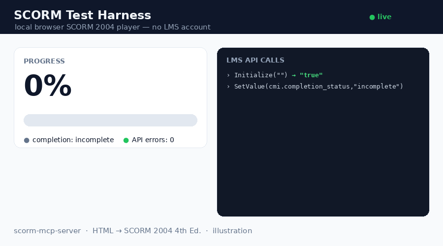

# scorm-mcp-server

> Turn self-contained HTML **or a Claude Design `.dc` bundle** into a **SCORM 2004 4th Edition** package ready to import into any LMS — assets inlined for **100% offline**, completion / progress / **score** tracking injected, ADL schemas bundled.

[](https://www.npmjs.com/package/scorm-mcp-server)




*The bundled local harness (`scorm-test-harness.html`) playing a package: progress 0 → 100%, completion, and the live LMS API-call log (0 errors). Illustration.*

An **MCP server** exposing a single tool, **`scorm_package`**, that converts a finished HTML learning module into a `.zip` (PIF) any SCORM-compliant LMS can import.

**Principle: WRAP, don't rewrite.** Your HTML is preserved; the tool only:

1. **Inlines every asset** (CSS, `@import`, fonts, JS, images, `srcset`, favicons) as data URIs → runs **100% offline**.
2. **Injects a small runtime** that reports **completion**, **progress (%)** and **time spent**, with **resume** across sessions.
3. **Generates the manifest** and **bundles the 15 official ADL XSD schemas** — the manifest is validated against them (real conformance, not just "well-formed").

> 🇫🇷 README in English for reach; the in-depth handoff doc (`PASSATION.md`) and guides are in French.

## ✅ Status — validated on a real LMS

- **108/108 automated checks** green: 23 converter · 15 runtime · 12 MCP · 1 schema conformance (`xmllint`) · 6 security · 11 features · 13 auto-milestones · 21 V2 (bundle / `.dc` / score) — plus 6 bonus strict-runtime checks (`scorm-again`).
- **SCORM Cloud (real LMS):** imports cleanly (recognized as *SCORM 2004 4th Ed.*, "manifest looks great"), and the dashboard reports **completion = complete, success = passed, time tracked**.

## Input formats

| Input (`input_path` or `html`) | Handling |
|---|---|
| A single self-contained `.html` (e.g. Claude Design "standalone HTML" export) | assets inlined, runtime injected — v1 path |
| A **folder or `.zip`** (multi-file module) | whole tree preserved; entry HTML inlined; manifest lists every file |
| A **Claude Design `.dc` bundle** (`*.dc.html` + `support.js` + `_ds/`) | auto-detected; CDN libs (React/Babel…) **vendored offline** via `window.__resources` (no source patch); runtime injected before `support.js` |

Pass a `.dc` bundle as its **folder or `.zip`** (not the lone `.dc.html`, which is inert without its siblings).

## Scores & quizzes (optional)

Set **`mastery_score`** (0..1) to enable score-based success and add sequencing objectives to the manifest. Report the score from your content in one line — no SCORM knowledge required:

```js
window.SCORM2004.score(8, 0, 10);                                   // raw, min, max
window.dispatchEvent(new CustomEvent("scorm:score",    { detail: { raw: 8, min: 0, max: 10 } }));
window.dispatchEvent(new CustomEvent("scorm:progress", { detail: 0.5 }));  // 0..1
window.dispatchEvent(new CustomEvent("scorm:complete"));
```
The runtime maps these to `cmi.score.*`, sets `success_status = passed/failed` against `mastery_score`, and reports completion/progress. (`dc:*` event names are accepted as aliases.)

## Install

### Option A — one-click (recommended)
Download **`scorm-mcp-server-x.y.z.mcpb`** from the [Releases](../../releases), then in **Claude Desktop → Settings → Extensions**, drag-drop the `.mcpb`, pick an output folder, and enable it.

### Option B — npm (any MCP client)
No install step: add this to your client's MCP config (`~/Library/Application Support/Claude/claude_desktop_config.json` for Claude Desktop):
```json
{
  "mcpServers": {
    "scorm": {
      "command": "npx",
      "args": ["-y", "scorm-mcp-server"],
      "env": { "SCORM_OUTPUT_DIR": "/ABSOLUTE/PATH/scorm-packages" }
    }
  }
}
```
Registry name: **`io.github.giacomomaria81/scorm-mcp-server`** ([MCP registry](https://registry.modelcontextprotocol.io/v0/servers?search=scorm-mcp-server)).

### Option C — from source (developer)
```bash
git clone <this-repo> && cd scorm-mcp-server
npm install        # dist/ is prebuilt; npm run build is optional
```
Then point the config at `node /ABSOLUTE/PATH/scorm-mcp-server/dist/index.js`.

Restart Claude. The `scorm_package` tool is now available.

## Usage

In a conversation: build your module with Claude Design, then say **"package this module as SCORM."** Claude calls `scorm_package` and returns the path to the `.zip`.

### Progress & completion — it just works
**You don't have to prepare anything**: if your HTML declares no milestone, the packager **auto-generates them from the document structure** (sections → articles → headings, capped at 8, trigger `view`). Plain HTML gets meaningful progress out of the box. Disable with `auto_milestones: false`. Want `success_status = passed` on completion without touching the HTML? Pass `success_on_completion: true`.

### Declarative milestones (recommended for fine control)
Mark the meaningful steps directly in your HTML — explicit milestones always take precedence over auto-generation. The runtime computes `progress_measure = milestones_reached / total`, and sets `completion_status = "completed"` once all are reached.

| Attribute | Effect |
|---|---|
| `data-jalon="unique-id"` | declares a milestone |
| `data-trigger="view"` | reached when scrolled into view (**default**) |
| `data-trigger="click"` | reached on click |
| `data-trigger="ended"` | reached when a video/audio ends |

```html
<section data-jalon="intro"       data-trigger="view">…</section>
<button  data-jalon="read-pitch"  data-trigger="click">I read it</button>
<video   data-jalon="demo"        data-trigger="ended">…</video>
```

Recommended: **4–8 milestones per micro-module**. Resume is automatic (`cmi.suspend_data` + `cmi.location`); progress never regresses.

**Programmatic milestones** — `window.SCORM2004.reach("quiz-passed")` works even if the id has no `data-jalon` element: unknown ids are **declared on the fly** and count in the total. To register one *before* it's reached (accurate denominator), use `window.SCORM2004.declare("quiz-passed")` early. Both survive resume.

**Success status (opt-in)** — add `data-scorm-success="on-completion"` on any element (e.g. `<body>`) and the runtime also sets `cmi.success_status="passed"` when the module completes. Without it, `success_status` is never written.

**Language** — the tool's `language` (BCP-47, default `fr-FR`) is applied as `<html lang="…">` when the source HTML doesn't declare one.

**Security** — asset references are confined to the module folder: `../` or absolute paths outside it are never inlined (a warning is emitted instead).

## Test it without an LMS account

Open `scorm-test-harness.html` via a tiny local server and drop a generated `.zip` into it:
```bash
python3 -m http.server 8000   # then open http://localhost:8000/scorm-test-harness.html
```
You'll see live progress %, completion, and the full log of LMS API calls (0 errors expected).

## Build & test

```bash
npm install
npm run build     # tsc -> dist/
npm test          # 102 checks: converter + runtime + mcp + schema + security + v2 (xmllint required)

# bonus: validate against a strict independent SCORM 2004 runtime
npm i -D scorm-again && node test/scorm-again.test.mjs
```
Requirements: **Node ≥ 20**, and `xmllint` (`libxml2-utils`) for the schema test.

## Project structure
```
src/        index.ts (MCP server) · converter.ts (inlining + manifest + zip) · runtime.ts (injected SCORM runtime)
dist/       compiled output (shipped)
schemas/    15 ADL XSD (SCORM 2004 4th Ed.), bundled into every package
test/       converter / runtime / mcp / schema tests + fixtures + sample module
scorm-test-harness.html   local browser SCORM player (fake LMS, no account)
manifest.json             MCPB manifest (for building the .mcpb desktop extension)
```

## Privacy Policy

This extension runs **entirely locally**: no data collection, no telemetry, no third parties. The only network activity is downloading assets that *your own HTML* references, to embed them into the offline package. Full policy: [PRIVACY.md](./PRIVACY.md).

## License

[MIT](./LICENSE)
